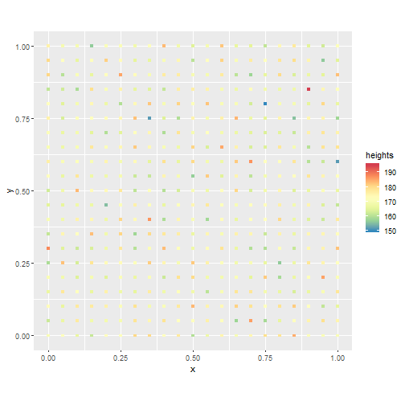
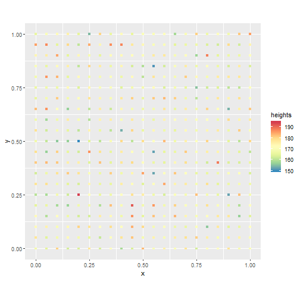

Maps as Processes
========================================================
author: Alexis Polidoro and Megan Coad 
date: 
autosize: true

Key Concepts 
========================================================

- Random Processes
- Null Landscapes
- Deterministic Processes
- Stochastic Processes 
- Simulaitng Spatial Processes

Random Processes
========================================================
- Does not mean ANY outcome
- Ex: Rolling a dice, flipping a coin
- limited information available

Null Landscape
========================================================

***
- Cannot make predicitons of results
- Using rnadom variables to create random maps
- Prove a benchmark to compare statistical maps

Deterministic Processes
========================================================

***
- No element of Randomness 
- Predicted with complete certainty 

Stochastic Processes
========================================================

***
- Both random and Deterministic 
- Deterministic Component: the probability of an event is zero if x <= 0.5
- Random Component: the probability of a coordinate being an event is 0.5 when x > 0.5

Simulating Spatial Processes
========================================================

***

- Probability of an event increases in the "East" direction
- Natural Process? 

Concluding Remarks
========================================================
- Not all processes are the same
- Null landscapes are completely random 
- Spatial processes have practical applications 
