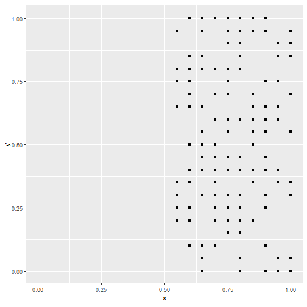

<!---
REFLECTION FOR THIS WEEK (JAN 24)
I feel like this reflection went well. I felt confident with the information and its delivery, however, there was a question asked regarding the prediction of deterministic processes. I answered the question specifying that deterministic processes predict the location of a new event, however that was only speficif to the example of the tree farm. For the future, it would be critical to add that predicting new events (of a determnistic process) is specific to the event, and it can be predicted in new ways for various landscapes (ie, prediting height of trees in a tree farm, as older, taller trees would be in a different location) During the activity, some students had questions regarding how to create different types of random landscapes, and it may be beneficial to add some code to the mini lecture slides to effectively communicate how we can create different types of random patterns in R. 
--->

Maps as Processes
========================================================
author: Alexis Polidoro and Megan Coad 
date: 
autosize: true

<!---
In the key concepts, make sure to reflect on what we did last week
--->

Key Concepts 
========================================================

- Different Degrees of Randomness
- Null Landscapes
- Deterministic Processes
- Stochastic Processes 
- Simulating Spatial Processes

Random Processes
========================================================
- Does not mean ANY outcome
- Ex: Rolling a dice, flipping a coin
- limited information available

Null Landscape
========================================================

<!---
Pay attention to the examples I provided below. I used the examples of tree distribution to show how trees can be randomly distributed over a landscape (forest) and systematically distributed on a tree farm (stochastic). The divide could be a result of a fense separating tree distribution. 
--->

***
- Using random variables to create random maps
- Difficult to predict results
- Example: Forests

Deterministic Processes
========================================================

***
- No element of Randomness 
- Predicted with complete certainty 
- Ex: Tree Farm

Stochastic Processes
========================================================

***
- Both random and Deterministic 
- Ex: Forest (Random Component), Fence (Deterministic Component)

Simulating Spatial Processes
========================================================

***

- Probability of an event increases in the "East" direction
- Natural Process causing this trend? Escarpment present?  

Concluding Remarks
========================================================
- Not all processes are the same
- Null landscapes are completely random 
- Spatial processes have practical applications 
