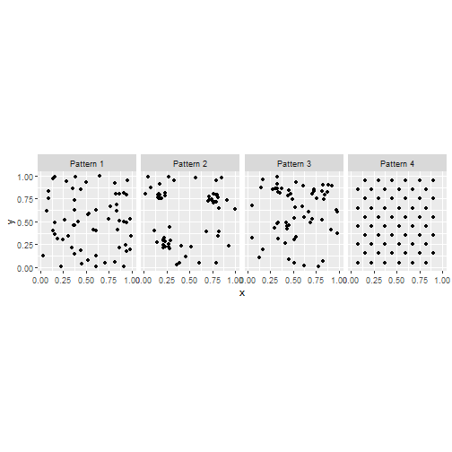
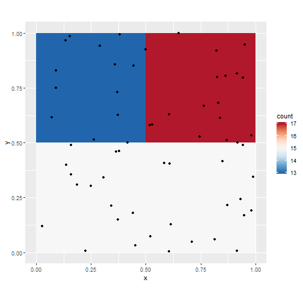
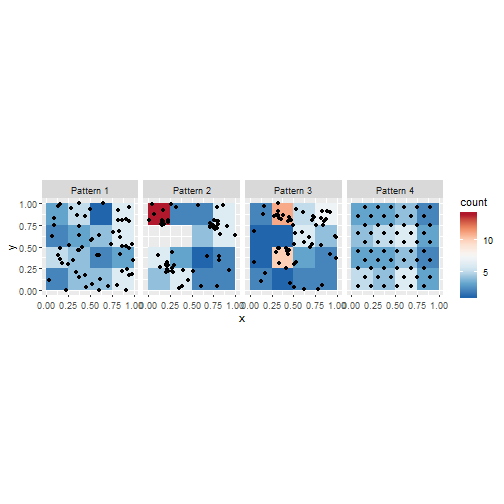
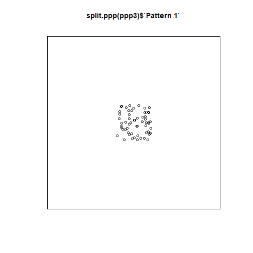

Point Pattern Analysis I
========================================================
author: Megan Coad and Alexis Polidoro
date: 
autosize: true

Key Points
========================================================
- understand what point pattern analysis is 
- intensity vs density 
- quadrats and density maps
- how to make a PPP object

Point Patterns
========================================================


- When only the coordinates are available for a set of data it is called a point pattern
- A point pattern is given by a set of events of interest that are observed in a region $R$
- A region has an infinite number of points (coordinates) on the plane 
- point patterns must be a complete _enumeration_ meaning every event that happened has been recorded

Processes and Point Patterns
========================================================
-  A key question of interest is whether the pattern is random
- Non-random patterns are likely the outcome of some meaningful process
- Deciding whether the pattern is random or not is the initial step towards developing hypotheses about the underlying process 

Faceting
========================================================
Faceting is a convenient way to simultaneously plot different parts of a dataframe.




Intensity and Density
========================================================
- The intensity of a spatial point process is the expected number of events per unit area denoted by $\lambda$
- Usually the process is unknown so intensity cannot be measured
- Instead the density is taken as the empirical estimate of the intensity
- Density is calculated as the number of events/the area of the region

Quadrats and Density Maps
========================================================
- Quadrats allow us to see how the density varies across the region by subdividing the region into a set of smaller subregions 


Quadrats and Density Contd. 
========================================================
- You can calculate the density for each quadrat


***
- You can also change the size of the quadrats

Creating a PPP object
========================================================
- `quadratcount` is a function that returns the number of events per quadrat
- To use this function you need to convert the point patterns to a `ppp`
1. Define the window by means of the `owin` function, and using the 0 to 1 interval for our region


```r
Wnd <- owin(c(0,1), c(0,1))
```

2. Create a `ppp` object


```r
ppp1 <- as.ppp(PointPatterns, Wnd)
```


Defining the Region for Analysis
========================================================
- When conducting analysis with point pattersn it is important to define a region for analysis that is consistent with the pattern of interest
- If the region is to big or to small the data will be harder to intrepret or could be misintrepreted

Example of Different Region Sizes 
========================================================

***



