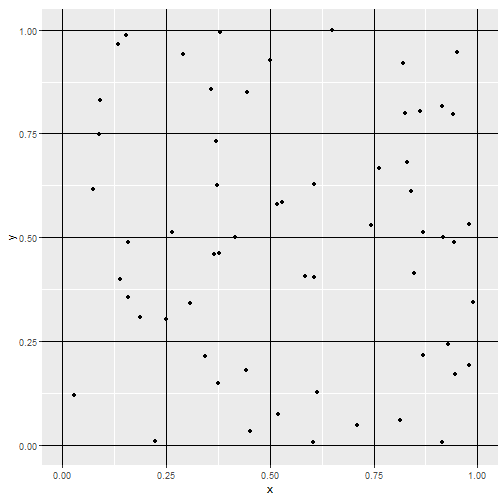
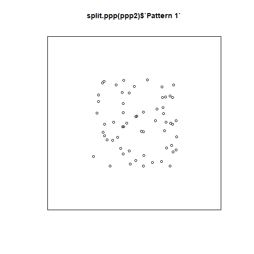

<!--- 
Reflection: 
A student made a comment about enumeration asking if it was okay if only one or two points were missing from the dataset. It was explained that the proportion of missing points is important (i.e. if its only 1 out of 100 points its okay but if its 50/100 then you can't do proper analysis). In addition to this, you often don't know how many points are missing so its always best to work with a complete enumeration not just a sample. A student also asked if changing the window size changes the spatial distribution of the points. It was explained that it simply changes how we see it visually, not the distribution of the points. In assignment, the values in the Chi-squared are residulas NOT p-values. The closer to 0 the residuals are the more confident you are that there is a random distribution.  
--->

Point Pattern Analysis I
========================================================
author: Megan Coad and Alexis Polidoro
date: 
autosize: true

Key Points
========================================================
- Understand what point pattern analysis is 
- Intensity vs density 
- Quadrats and density maps
- How to make a PPP object

Point Patterns
========================================================


-  a point pattern is a statistical map where the location of the event is the outcome of a process 
- A point pattern is given by a set of events of interest that are observed in a region $R$
- A region has an infinite number of points (coordinates) on the plane 
- Point patterns must be a complete _enumeration_ meaning every event that happened has been recorded

Processes and Point Patterns
========================================================
-  A key question of interest is whether the pattern is random
- Non-random patterns are likely the outcome of some meaningful process
- Deciding whether the pattern is random or not is the initial step towards developing hypotheses about the underlying process 

Faceting
========================================================
Faceting is a convenient way to simultaneously plot different parts of a dataframe.


Intensity and Density
========================================================
- The intensity of a spatial point process is the expected number of events per unit area denoted by $\lambda$
- Usually the process is unknown so intensity cannot be measured
- Instead the density is taken as the empirical estimate of the intensity
- Density is calculated as the number of events/the area of the region

Quadrats and Density Maps
========================================================
- Quadrats allow us to see how the density varies across the region by subdividing the region into a set of smaller subregions 



Quadrats and Density Contd. 
========================================================
- You can calculate the density for each quadrat


***
- You can also change the size of the quadrats

Creating a PPP object
========================================================
- `quadratcount` is a function that returns the number of events per quadrat
- To use this function you need to convert the point patterns to a `ppp`
1. Define the window by means of the `owin` function, and using the x-min, y-min to x-max, y-max interval for our region
- in this example it was set to 0,1


```r
Wnd <- owin(c(0,1), c(0,1))
```

2. Create a `ppp` object


```r
ppp1 <- as.ppp(PointPatterns, Wnd)
```

Defining the Region for Analysis
========================================================
- When conducting analysis with point pattersn it is important to define a region for analysis that is consistent with the pattern of interest
- It is critical that the window size is representative of the entire area where the underlying process could be occuring to accuratly intrepret the spatial distribution and resons for that distribution  

<!---
It is helpful to use an example to explain this concept. 
the window has to be represneteive of where the processes could occur. It is not just that the window could be to big or to small, but it may not represent the entire area where the process could be happening. E.g. In the small window it is possible that the window is appropriate because that is the region where processes could occur, if this is the case it is a legitimate cluster. If the process only happens in that small region then then window should be smaller and it is actually better reprerentative of a radom distribution.  
--->


Example of Different Region Sizes 
========================================================

***


Conclusion
=======================================================
- It is important that the point pattern you are working with is a complete enumeration 
- We calculate density to estimate intensity 
- You can split data up into quadrats to calculate density/quadrat which allows you to see how density varies over a region 
- To use the function required to find density per quadrat you must convert you data into a ppp object 
- Defining the correct region size is important for accurate intrepretation of the spatial distribution 
