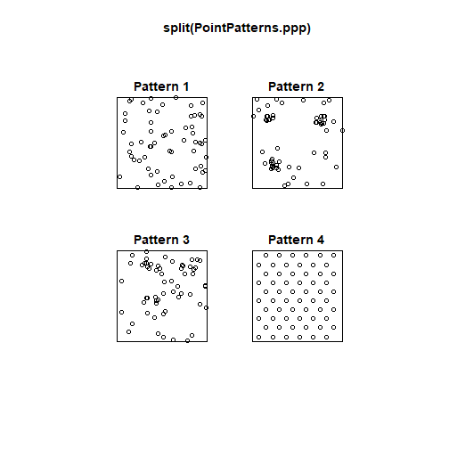
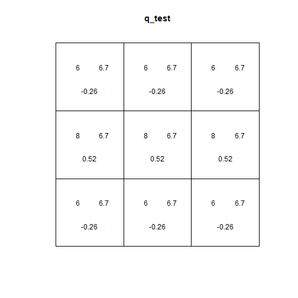
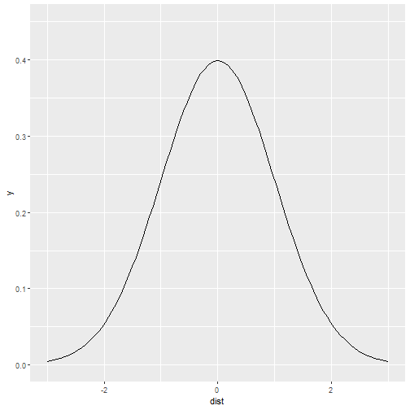

<!---
I felt confident with the delivery of material in today's mini lecture presentation. It is important to note that for next time, the p-value meaning should be indicated: for example, a low p-value (less than 0.05) means that there is a 'five percent chance that you are falsely rejecting the null hypothesis', but in simpler terms, it means that tere is a 95% chance that the pattern is not random/ a result of an underlying process. This should be clarified with Dr. Paez at the week of the meeting. Additionally, it will be important to add some information regarding the units of measurement when calculating the correct number of quadrats. Dr. Paez was unsure in lecture, therefore you are able to clarify what type of units we are using, and how we know. There were few students who asked questions during the activity period, therefore I think this chapter was well understod for the most part. 
--->

Point Pattern Analysis II
========================================================
author: Megan Coad and Alexis Polidoro
date: 
autosize: true

Key Concepts
========================================================

- Theory of Quadrat Test 
- Understanding the Residual Value
- Limitations of Quadrat Test 
- Kernel Density


Recall: PPP Objects and Quadrat Test  
========================================================



***
- PPP Represents two-dimensional point patterns
- Quadrat Test help us decide whether a pattern is random

Intuition: Calculating Quadrat Test  
========================================================
-Performs a test of Complete Spatial Randomness for a point pattern, based on quadrat counts

```

	Chi-squared test of CSR using quadrat counts

data:  split(PointPatterns.ppp)$"Pattern 4"
X2 = 1.2, df = 8, p-value = 0.006716
alternative hypothesis: two.sided

Quadrats: 3 by 3 grid of tiles
```

Intuition Continued: Plot Results of Quadrat Test  
========================================================

***
- Top left: Number of events in quadrat 
- Top Right: Expected number of events for null landscape
- Bottom: Residual; difference between observed and expected values. 


Calculating X2 (Quadrat Test Value)
========================================================
- Chi Square independence tests for a significant association between the categories of the two variables (events occurring and events expected)
- X2 is calculated using squared sum of the residuals
- The smaller this number, the more likely the event is random

Importance of the p-value
========================================================
- P-value is the probabiltiy that map is the result of a null process
- When p is small, this indicates it is unlikely that the point pattern reflects the theoretical random pattern, resulting in a random landscape
- 0.01 --> there is a 1% that the map is a result of a random process


Limitations: Size and Number of Quadrats 
========================================================
- Changing size of quadrat impacts the counts
- Events will not be properly accounted for if cell is too small
- General Rule: 

A = Area of the region, 
N = Number of events

$$
Q=\frac{2A}{N}
$$


Limitations Continued: Relative Position of Event
========================================================
- Fails to distinguish between different event distributions (Clustering vs Regularity)


Kernel Density: A Solution to Quadrat Test
========================================================
- Moving window over each grid cell
- Assigns highest "weight" to events closest to the centre of the bandwidth
- Accounts for relative position

***



Kernel Density: A solution to Quadrat Test 
========================================================

***


Concluding Remarks
========================================================
- Quadrat Test observes values as counts within a defined cell 
- Pearson residuals increase with difference in quantity of events
- Kernel density accounts for relative position of an event 

