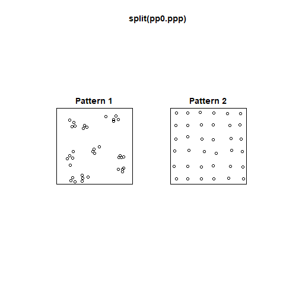
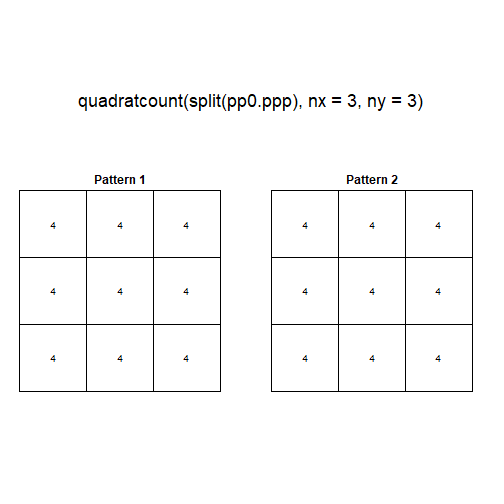
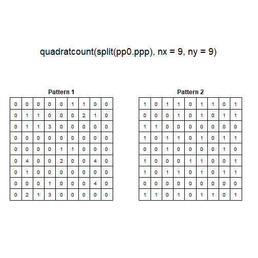
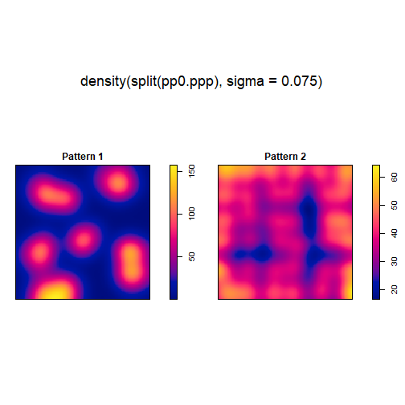
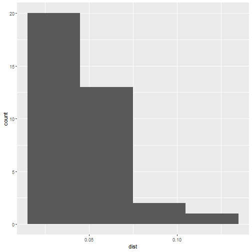
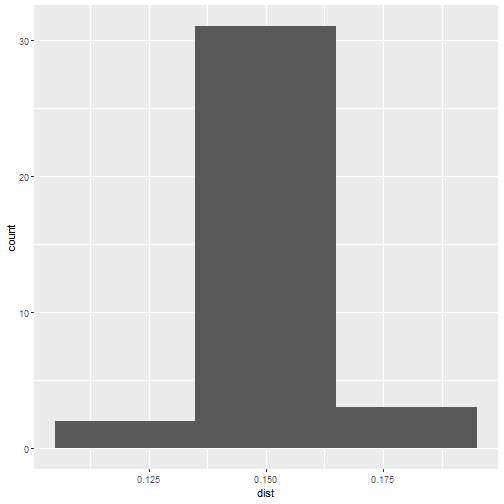
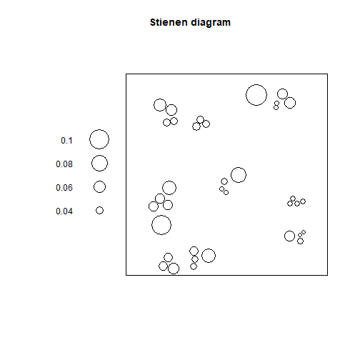
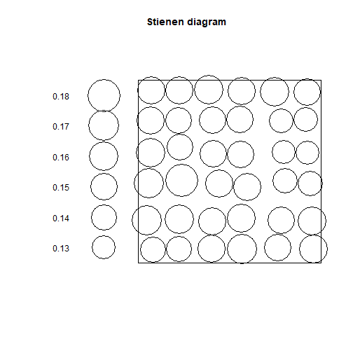
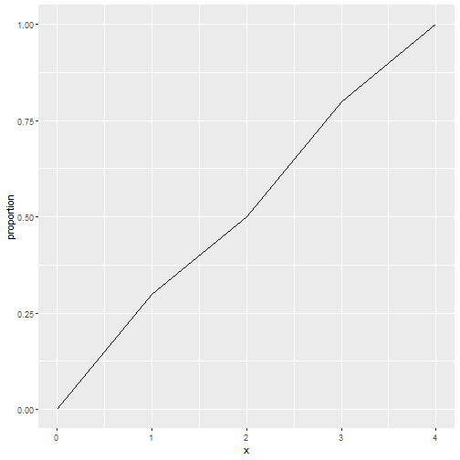
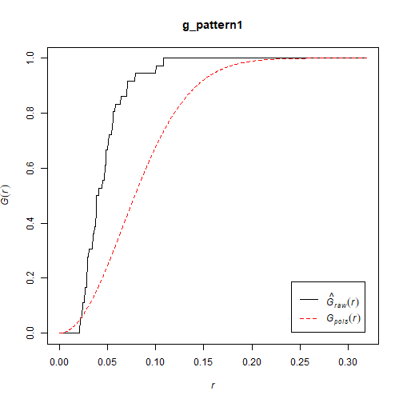

Point Pattern Analysis III
========================================================
author: Megan Coad and Alexis Polidoro
date: 
autosize: true

Key Points
========================================================

- Review Kernal Density Maps 
- Understand the Concept of Nearest Neighbors 
- Purpose of Stienan Diagrams
- What the G-function does


Motivation
========================================================


- Quadrats and kernel density are examples of density-based analysis
- Useful to help you understand large scale variation of a distribution of events
- Sometimes are less informative by not taking into account _small scale_ variations in the locations of the events.


Motivation contd. 
========================================================

- The two patterns above have similar _density_
- "Pattern 1" displays _clustering_
- "Pattern 2" displays _dispersion_ or _regularity_




Motivation contd. 
========================================================
- Changing parameters can show variation in density 
- The quality of the test deteriorates when there are many quadrats with small counts
- The smaller the quadrats are the more it resembles the actual point pattern making it increasingly less informative 



Recall: Kernel Density
========================================================
-  Used to visualize the smoothed estimate of the density
- Kernel density does not tell us if the density shown is higher or lower then what would be expected from a null landscape 



Nearest Neighbors
========================================================

- The nearest neighbor of a location is the event that is closest to said location given some metric
- This metric is often Euclidian distance on the plane (distance as measured using a straight line between the location and the event)
-  `spatstat` includes functions to calculate Euclidean distances
- `pairdist()`: returns the pairwise distance between all pairs of events i and j
- `nndist()`: returns a vector of distances from events to to their corresponding nearest neighbors
- `distmap()`: returns a pixel image with the distance from each pixel to the nearest event

Nearest Neighbors contd. 
========================================================


- Notice how most events have a nearest neighbor at a relatively short distance

***


- Most events have a nearest neighbor at a distance of approximately 0.15

Stienen Diagram
========================================================
-  A proportional symbol plot of the events 
- Size of symbols are proportional to the distance to their nearest neighbor


Stienen Diagram contd. 
=============================================================

- The largest circle is not very large, events that are relatively isolated are not a long distance away from their nearest neighbor
- This fits the definition of clustering

***


- All circles are very similar in size
- This fits the definition of dispersion

Steinen Diagram contd. 
==========================================================

- In a null landscape, the distribution of the size of the symbols would tend to be random


Cumulative Distribution Function
========================================================

-  _cumulative distribution function_  is the proportion of events that are have a nearest neighbor at a distance less than some value x
- Nummber of events and distance to their nearest neighbor can be plotted as proportions

```r
nnd <- c(1, 2, 0.5, 2.5, 1.7, 4, 3.5, 1.2, 2.3, 2.8)
```



G-Function
========================================================

- The cumulative distribution function of distances from event to nearest neighbor is called a _G-function_
- When the empirical $\hat{G}(x)$ is greater than the theoretical function this suggests that the events tend to be _closer_ than expected
- When the empirical function is less than the theoretical function, this would suggest a dispersed pattern
- The G-function is implemented in `spatstat` as `Gest`
- The `plot` function can be used to visualize the estimated G


G-Function contd. 
========================================================

- The empirical function is the solid black line, and the theoretical is the dashed red line
- About 50% of events have a nearest neighbor at a distance of less than approximately 0.04
- In the null landscape only about 16% of events have a nearest neighbor at less than 0.04
- This suggests that in the actual landscape events tend to be much closer to other events in comparison the null landscape, and would be suggestive of clustering



G-Function contd. 
========================================================

- The empirical function is below the one for the null landscape
- This is indicative of a dispersed, or regular pattern.


***
- The empirical function closely resembles the theoretical function for the null landscape


Concluding Remarks
==================================================================
- Nearest Neighbors quantifies the spatial distribution of your data and allows for further analysis 
- Steinen Diagrams, Cummulative Distribution Function and the G-function all provide different ways to analyse point pattern spatial distribution 


