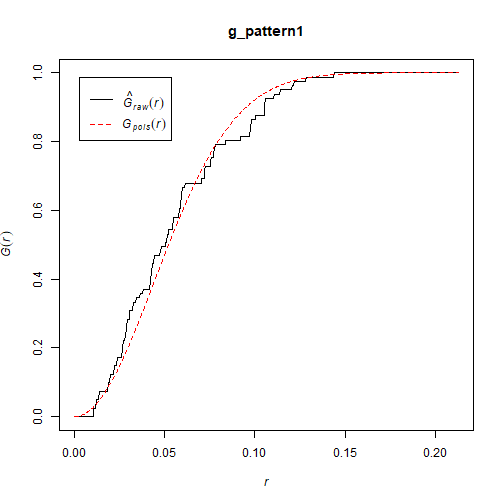
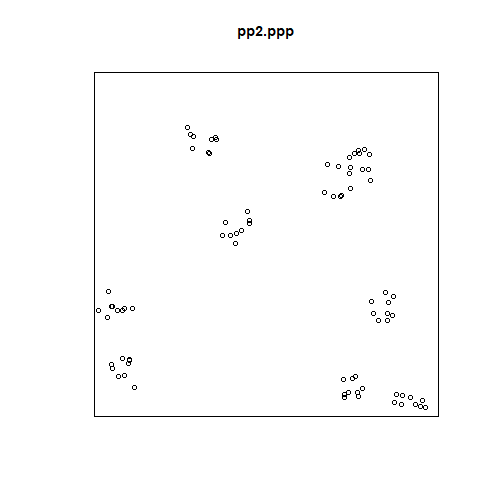
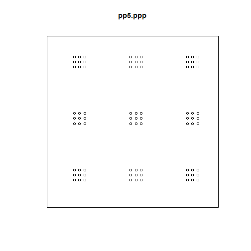
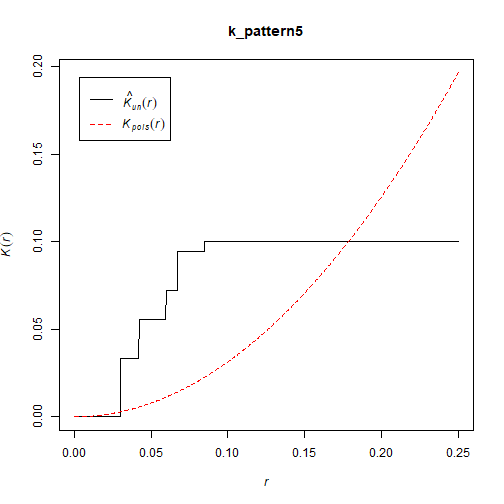

Point Pattern Analysis IV
========================================================
author: Alexis Polidoro and Megan Coad 
date: 
autosize: true

Key Concepts
========================================================

- F- or Empty Space function 
- Identifying Patterns at Multiple Scales
- K-function 

Recall: G-function 
========================================================
- Cumulative distribution of events to their nearest event
- 40% of events have nearest neighbour at a distance less than X 

***

F-function
========================================================
- Another useful tool for point patterns
- Distribution of "point to nearest event" 
- Single scale 

F-function Continued...
========================================================

***
- Empirical below theoretical = clustering

Patterns At Multiple Scales: Issues
========================================================
- missing patterns at different scales: clustering at small scale, regularity at larger scales

K-function
========================================================
- Solution to the limitations of the F-function 
- Interpreted as counting events in a given radius
- Detects patterns at multiple scales

K-function Continued
========================================================
- empirical>theoretical: clustering 

***

Concluding Remarks
========================================================
- F-function determines point to their nearest event at a single scale 
- Single scale does not detect all patterns in a null landscape 
- K-function is a useful tool to detemermine nearest events at multiple scales
