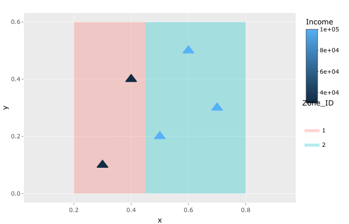
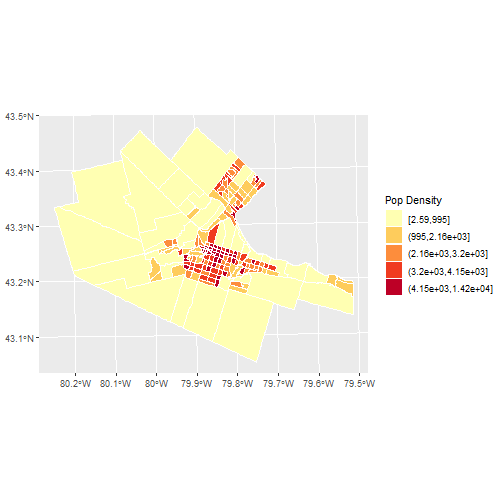
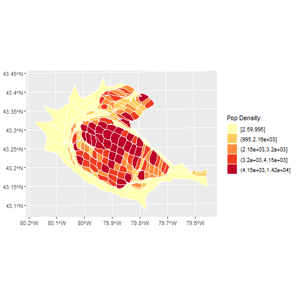

Area Data I
========================================================
author: Alexis Polidoro and Megan Coad 
date: 
autosize: true

Key Concepts
========================================================

- What is area data?
- Processes explained through area data
- Visualizing area data


What is Area Data? 
========================================================
Point Pattern Analaysis: have a 'Unit of Support' containing information, while the location itself is considered random

Area Data Analysis: Do not have a 'Unit of Support' to store information, but rather some sort of geometrry (like an area)
- Ex: Dissemenation Areas, Postal Codes

Allocating Information
========================================================
Allocate information by centroids, unique identifers/ attributes 
- Centroid: Mean of X and Y coordinates in an area 
- Unique Identifer: Assigning value to a region based on a specific attribute

Creating a Surface for Area Data Analysis
========================================================
Create dataframe with locations of households and income

```r
df <- data.frame(x = c(0.3, 0.4, 0.5, 0.6, 0.7), y = c(0.1, 0.4, 0.2, 0.5, 0.3), Income = c(30000, 30000, 100000, 100000, 100000))
```

Create Dataframe with zones

```r
zones1 <- data.frame(x1=c(0.2, 0.45), x2=c(0.45, 0.80), y1=c(0.0, 0.0), y2=c(0.6, 0.6), Zone_ID = c('1','2'))
```


Explaining Area Data
========================================================
- Can determine information about an area using points
- Why is income higher in East? (more isolation, escartment) 
- Trends to explain similar values? 

***




Visualizing Area Data: Choropleth Maps
========================================================
- Map of the polygons that form the areas in the region, each colored in a way to represent the value of an underlying variable



Visualizing Area Data: Cartograms
========================================================
- Map where the size of the zones is adjusted so that it is proportional to some other variable of interest (population density)




Conclusions
========================================================

- Area data is comprised of a defined boundary of coordinates 
- We can use points to tell us information about an area 
- Choropleth Maps and Cartograms are examples of communicating area data 
