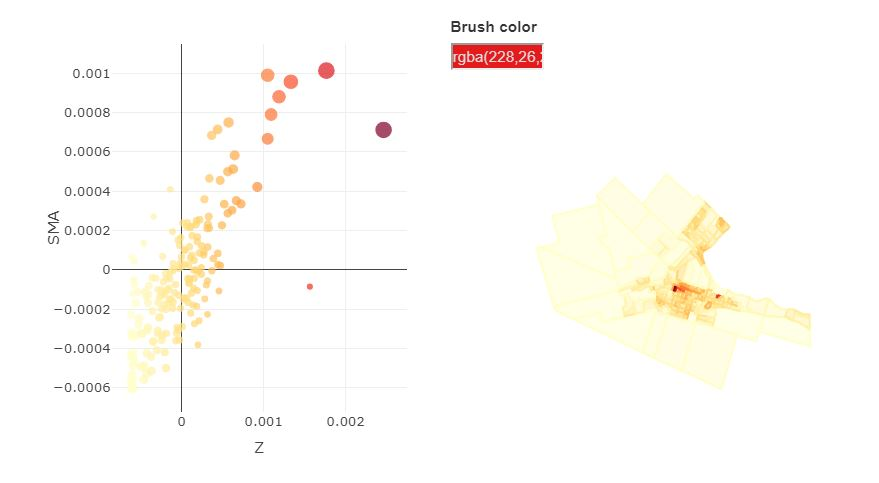
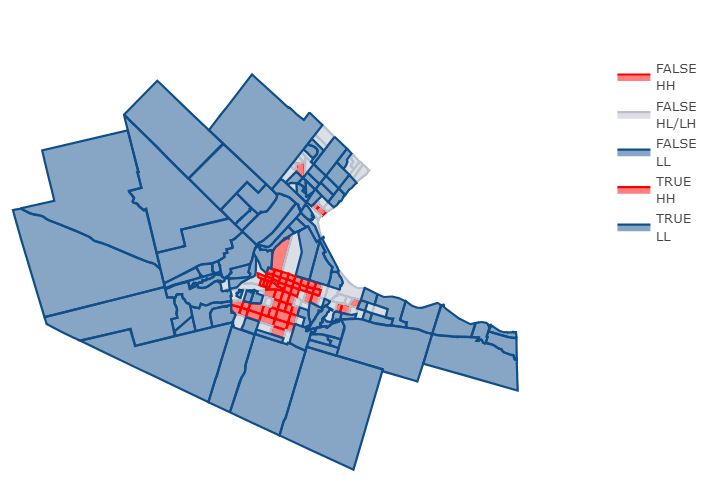
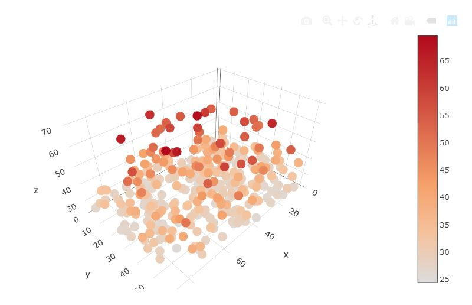
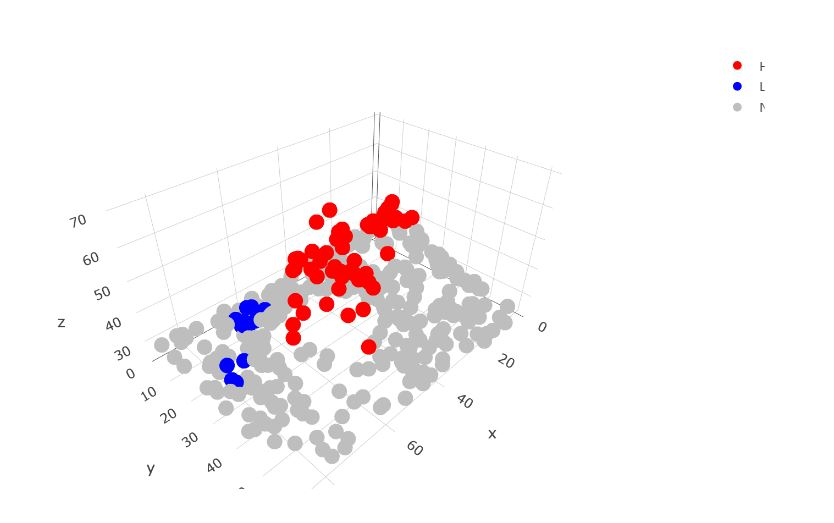

Area Data IV
========================================================
author: Megan Coad and Alexis Polidoro
date: 
autosize: true

Key Points
========================================================

- Understand how to visualize Moran's I and local Moran's I
- Understand other forms of Local Analysis of Spatial Association
- know what Bonferroni correction does and when to use it

Decomposing Moran's I
=============================================================


- Moran's I coefficient of spatial autocorrelation is derived based on the idea of aggregating the products of a (mean-centered) variable by its spatial moving average, and then dividing by the variance
- when plotting Moran's scatterplot some observations are highlighted because they make a particularly large contribution to $I$.


Intrepreting Moran's Plot
========================================================



***

- The darker colors are zones with higher population densities. The size of the dots in the scatterplot indicates the contributions of the zone to Moran's $I$. 

- The plots are linked for brushing: try selecting groups of dots in the scatterplot. Change the color for brushing to select a different group of dots. Can you identify in the map the zones that most contribute to Moran's $I$?


 Local Moran's I and Mapping
========================================================
- The local version of Moran's $I$ is implemented in `spdep` as `localmoran`, and can be called with a variable and a set of spatial weights as arguments
- The value of the function is a matrix with local Moran's $I$ coefficients, and their corresponding expected values and variances
- hypothesis testing can be conducted by comparing the empirical statistic to its distribution under the null hypothesis of spatial independence
- An advantage of the local decomposition described here is that it allows the analyst to map the statistic to better understand the spatial pattern.

Local Moran's I and Mapping
========================================================


***
- The map shows whether population density in a zone is high, surrounded by other zones with high population densities (HH), or low, surrounded by zones that also have low population density (LL). Other zones have either low population densities and are surrounded by zones with high population density, or viceversa (HL/LH).


A Concentration approach for Local Analysis of Spatial Association
========================================================
- Imagine that you stand at a given location on that landscape and survey your surroundings. If your surroundings look very similar to you (i.e., if their elevation is similar, relative to the rest of the landscape), you would take that as evidence of a spatial pattern, at least locally. This is the idea behind spatial autocorrelation analysis.


A Concentration approach for Local Analysis of Spatial Association Contd. 
========================================================


***
- Imagine that you stand at coordinates x = 53 and y = 34. How much wealth is concentrated in the neighborhood of the focal point?

```
[1] 832.0156
```
- Recall that the total of the variable for the region is 12,034.34.
- If you change the radius r to a very large number, the concentration of the variable will simply become the total sum for the region. Essentially, the whole region is the "neighborhood" of the focal point.

A Short Note on Hypothesis Testing
========================================================
- Local tests as introduced above are affected by an issue called _multiple testing_.
- A risk when conducting a large number of tests is that some of them might appear significant _purely by chance!_ The more tests we conduct, the more likely that at least a few of them will be significant by chance
- A crude rule to adjust for this is called _Bonferroni correction_.
- If we apply this correction to the analysis above, we see that instead of 0.05, the p-value needed for significance is much lower:

```
[1] 0.0001428571
```

- Bonferroni correction is known to be overly strict, and sharper approaches exist to correct for multiple testing. Observations that are flagged as significant with the Bonferroni correction, will also be significant under more refined corrections, so it provides a most conservative decision rule.

Detection of Hot and Cold Spots
========================================================

- local statistics can be very useful in detecting what might be termed "hot" and "cold" spots. 
- A _hot spot_ is a group of observations that are significantly high
- A _cold spot_ is a group of observations that are significantly low

***




Conclusion: 
==================================================================
- Morans Plot can be very useful in visualizing spatial distribution of area data 
- Local Moran's I provides more insight about the local variations and how one area differs from areas surrounding 
- Concentration approach is another form of Local Statistics of Spatial Association that also allows you to assess neighbouring areas and their relation to a focal point. 
- The issue of multiple testing can be solved using the Bonferroni correction 
- local statistics can help us identify hot and cold spots 
