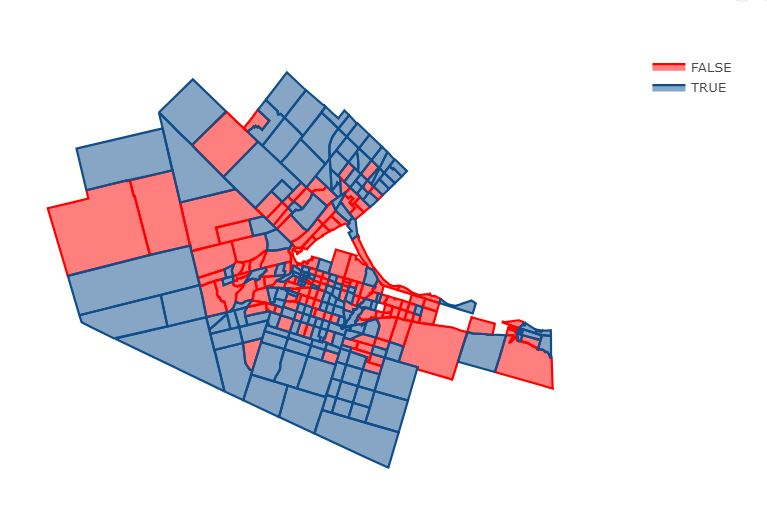
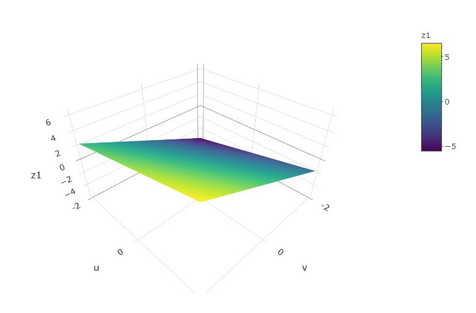
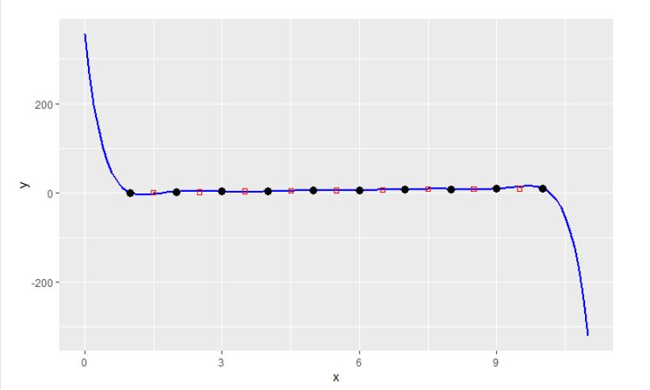

Area Data VI
========================================================
author: Megan Coad and Alexis Polidoro
date: 
autosize: true


Key Points
========================================================

- Understand implications of incorrect functional form 
- 


Incorrect Functional Form
========================================================


 - An incorrect functional form can lead to residual spatial autocorrelation
 - To illustrate this we can simulate a spatial process
 
$$
z = f(x,y) = exp(\beta_0)exp(\beta_1x)exp(\beta_2y) + \epsilon_i
$$

- this is a non-linear spatial process


Incorrect Functional Form Contd. 
========================================================

-  Suppose that we estimate the model as a linear regression that does not correctly capture the non-linearity  
- The model would be as follows:

```

Call:
lm(formula = z ~ u + v, data = HamiltonDAs)

Residuals:
    Min      1Q  Median      3Q     Max 
-2.7267 -0.8591  0.0028  0.8250  3.5826 

Coefficients:
            Estimate Std. Error t value Pr(>|t|)    
(Intercept)  -3.6765     0.3255  -11.29   <2e-16 ***
u            20.9207     0.8586   24.37   <2e-16 ***
v            44.8033     0.9305   48.15   <2e-16 ***
---
Signif. codes:  0 '***' 0.001 '**' 0.01 '*' 0.05 '.' 0.1 ' ' 1

Residual standard error: 1.231 on 294 degrees of freedom
Multiple R-squared:  0.8965,	Adjusted R-squared:  0.8958 
F-statistic:  1273 on 2 and 294 DF,  p-value: < 2.2e-16
```


Incorrect Functional Form Contd. 
========================================================


- the model gives the impression of a very good fit: all coefficients are significant, and the coefficient of multiple determination $R^2$ is moderately high.

- it is important to examine the residuals to verify that they are independent

- A map of the residuals can help examine their spatial pattern




Incorrect Functional Form Contd.
========================================================
- To test the residuals for spatial autocorrelation we first create a set of spatial weights

```r
HamiltonDAs.w <- nb2listw(poly2nb(as(HamiltonDAs, "Spatial")))
```

- we can now calculate Moran's $I$:

```r
moran.test(HamiltonDAs$model1.e, HamiltonDAs.w)
```

```

	Moran I test under randomisation

data:  HamiltonDAs$model1.e  
weights: HamiltonDAs.w    

Moran I statistic standard deviate = 10.373, p-value < 2.2e-16
alternative hypothesis: greater
sample estimates:
Moran I statistic       Expectation          Variance 
      0.350300067      -0.003378378       0.001162633 
```

- The test does not allow us to reject the null hypothesis of spatial independence
- despite the apparent goodness of fit of the model, more analysis needs to be done

Incorrect Functional Form Contd. 
========================================================

- Lets now use a variable transformation to approximate the underlying non-linear process:


- This model does not necessarily have a better goodness of fit but when we test for spatial autocorrelation you can see that the model is better at capturing underlying processes 


```

	Moran I test under randomisation

data:  HamiltonDAs$model2.e  
weights: HamiltonDAs.w    

Moran I statistic standard deviate = 0.59638, p-value = 0.2755
alternative hypothesis: greater
sample estimates:
Moran I statistic       Expectation          Variance 
      0.016946454      -0.003378378       0.001161482 
```


Omitted Variables
========================================================

- Using the same example, suppose now that the functional form of the model is correctly specified, but a relevant variable is missing
- We can plot a map of the residuals to examine their spatial pattern 
- the visual inspection makes it clear that there is an issue with spatially autocorrelated residuals
- the model with the full set of relevant variables resolves this problem

***


Trend Surface Analysis
========================================================

- generates relatively flexible surfaces
- This approach consists of using the coordinates as covariates, and transforming them into polynomials of different orders


Trend Surface Analysis Contd. 
========================================================
First, create a grid of coordinates for plotting:

```r
df <- expand.grid(u = seq(from = -2, to = 2, by = 0.2), v = seq(from = -2, to = 2, by = 0.2))
```

Next, select some values for the coefficients:

```r
b0 <- 0.5 #0.5
b1 <- 1 #1
b2 <- 2 #2
z1 <- b0 + b1 * df$u + b2 * df$v
z1 <- matrix(z1, nrow = 21, ncol = 21)
```

Then plot is:



- Higher order polynomials are possible however the higher the order of the polynomial, the more flexible the surface, which may lead to issues


Multicollinearity
========================================================
- When two variables are highly collinear, the model has difficulties discriminating their relative contribution to the model
- This is manifested by inflated standard errors that may depress the significance of the coefficients, and occasionally by sign reversals


 Overfitting
========================================================
- when a model fits too well the observations used for callibration it may fail to fit new information well
- We can compute the _root mean square_  for multiple models to tell us the expected size of error when making a predition given a model (and to test for overfitting)


Edge effects
========================================================
- Another consequence of overfitting, is that the resulting functions tend to display extreme behavior when taken outside of their estimation range, where the largest polynomial terms tend to dominate. 



Expansion Method
========================================================
- suppose that there is the following initial model of proportion of donors in a population, with two variables of substantive interest:
$$
d_i = \beta_i(u_i,v_i) + \beta_1(u_i,v_i)I_i + \beta_3(u_i,v_i)Ed_i + \epsilon_i
$$
- the coefficients in this model are allowed to adapt by location

- it is not possible to estimate one coefficient per location. In this case, there are $n\times k$ coefficients, which exceeds the size of the sample ($n$). It is not possible to retrieve more information from the sample than $n$ parameters (incidental parameter problem.)

- A  solution is to specify a function for the coefficients
$$
\begin{array}{l}
\beta_0(u_i, v_i) = \beta_{01} +\beta_{02}u_i + \beta_{03}v_i\\
\beta_1(u_i, v_i) = \beta_{11} +\beta_{12}u_i + \beta_{13}v_i\\
\beta_2(u_i, v_i) = \beta_{21} +\beta_{22}u_i + \beta_{23}v_i
\end{array}
$$

Expansion Method Contd. 
========================================================

- By specifying the coefficients as a function of the coordinates, we allow them to vary by location.

- if we substitute these coefficients in the intial model, we arrive at a final expanded model:
$$
d_i = \beta_{01} +\beta_{02}u_i + \beta_{03}v_i + \beta_{11}I_i +\beta_{12}u_iI_i + \beta_{13}v_iI_i + \beta_{21}Ed_i +\beta_{22}u_iEd_i + \beta_{23}v_iEd_i + \epsilon_i
$$

- This model has now nine coefficients, instead of $n\times 3$, and can be estimated as usual


Geographically Weighted Regression
========================================================
- the functions in this model are left unspecified
- The spatial variation of the coefficients results from an estimation strategy that takes subsamples of the data in a systematic way
- uses a moving window that visits a focal point and estimates a weighted least squares model at that location
- The results of the regression are conventionally applied to the focal point, in such a way that not only the coefficients are localized, but also every other regression diagnostic

Geographically Weighted Regression Contd. 
========================================================

-  selecting the kernel bandwidth is important 
- If the window is too large the local models tend towards the global model and if the window is too small, the model tends to overfit
- Since estimation requires the selection of a kernel bandwidth, and a kernel bandwidth requires the estimation of many times leave-one-out regressions, GWR can be computationally quite demanding, especially for large datasets.


Spatial Error Model
========================================================
- A model that can be used to take direct remedial action with respect to residual spatial autocorrelation

- This model is specified as follows:
$$
y_i = \beta_0 + \sum_{j=1}^k{\beta_kx_{ij}} + \epsilon_i
$$

- it is no longer assumed that the residuals $\epsilon$ are independent, but instead display map pattern, in the shape of a moving average:
$$
\epsilon_i = \lambda\sum_{i=1}^n{w_{ij}^{st}\epsilon_i} + \mu_i
$$


