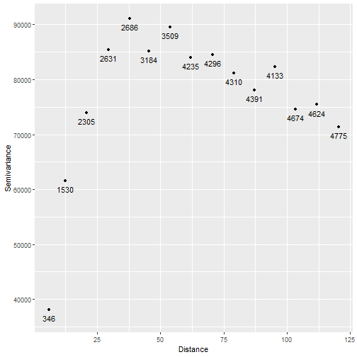
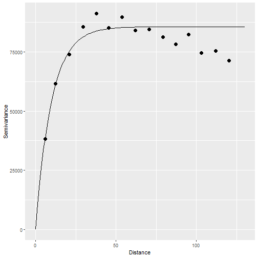
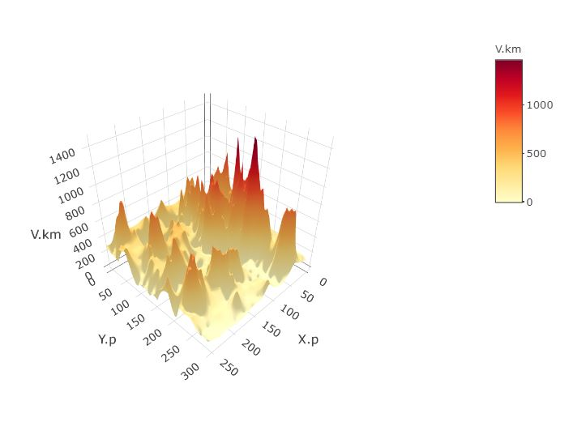
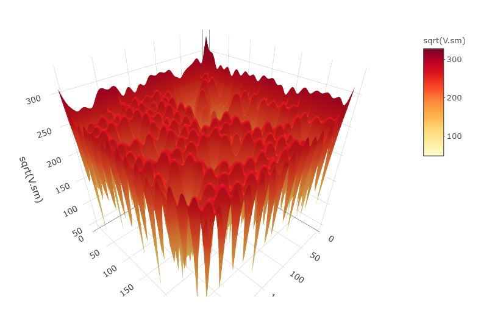

Spatially Continuous Data IV
========================================================
author: Megan Coad and Alexis Polidoro
date: 
autosize: true


Key Points
========================================================

- Exploiting information using K-Point means 
- Understand how to do Kriging and the benifits of it 


Using residual spatial pattern to estimate prediction errors
========================================================


- To begin this step, re-calculate the trend surface analysis of best fir for the data (for the walker lake data it was a cubic model)
- The trend surface provides a smooth estimate of the field, however, it is not sufficient to capture all systematic variation, and fails to produce random residuals
- A  way of enhancing this approach to interpolation is to _exploit_ the information that remains in the residuals, for instance by the use of $k$-point means.


Exploiting Information using K-point means 
========================================================
1. We first need the set of _target_ points (the points for the interpolation), as well as the _source_ (the observations)


```r
target_xy = expand.grid(x = X.p, y = Y.p)
source_xy = cbind(x = Walker_Lake$X, y = Walker_Lake$Y)
```

2. now we use the `kpointmean` function to interpolate the residuals, for instance using $k=5$ neighbors:

```r
kpoint.5 <- kpointmean(source_xy = source_xy, z = WL.trend3$residuals, target_xy = target_xy, k = 5)
```

3. Given the estimated residuals, we can add them to the cubic trend surface

```r
z.p3 <- matrix(data = WL.preds3$fit[,1] + kpoint.5$z,
               nrow = length(Y.p), ncol = length(X.p), byrow = TRUE)
```

4. produce an interpolated field:


Considerations Using K-Point Means 
========================================================

- A question is how to decide the number of neighbors to use in the calculation of the k-point means. As previously discussed, $k = 1$ becomes identical to Voronoi polygons, and $k = n$ becomes the global mean.

- A second question concerns the way the average is calculated.It is possible to estimate the way in which spatial dependence weakens with distance. Why should more distant points be weighted equally? The answer is, there is no reason why they should, and variographic analysis elegantly solves this, as well the question of how many points to use: all of them, with varying weights.


Kriging: a method for optimal prediction 
========================================================

- Kriging is known to have the properties of Best (in the sense that it minimizes the variance) Linear (because of predictions are a linear combination of weights) Unbiased (since the estimators of the prediction errors are zero) Estimator, or BLUP

- Lets first conduct variographic analysis of the residuals.

```r
Walker_Lake.sp <- Walker_Lake
coordinates(Walker_Lake.sp) <- ~X+Y
```

***

- The variogram of the residuals can be obtained by specifying a trend surface in the formula:


- You can verify that the semivariogram above corresponds to the residuals by repeating the analysis directly on the residuals


Kriging: a method for optimal prediction 
========================================================

- The empirical semivariogram is used to estimate a semivariogram function:

```r
variogram_v.t <- fit.variogram(variogram_v, model = vgm("Exp", "Sph", "Gau"))
variogram_v.t
```

```
  model   psill    range
1   Nug     0.0 0.000000
2   Exp 85554.4 9.910429
```

Kriging: a method for optimal prediction
======================================================
- The variogram function plots as follows:

```r
gamma.t <- variogramLine(variogram_v.t, maxdist = 130)
ggplot(data = variogram_v, aes(x = dist, y = gamma)) +
  geom_point(size = 3) + 
  geom_line(data = gamma.t, aes(x = dist, y = gamma)) +
  xlab("Distance") + ylab("Semivariance")
```




```
[using universal kriging]
```


Kriging: a method for optimal prediction 
========================================================

Extract the predictions and prediction variance from the object `V.kriged`:

```r
V.km <- matrix(data = V.kriged$var1.pred,
               nrow = 119, ncol = 103, byrow = TRUE)
V.sm <- matrix(data = V.kriged$var1.var,
               nrow = 119, ncol = 103, byrow = TRUE)
```


***

You can now plot the interpolated field:



Kriging: a method for optimal prediction 
========================================================
You can also plot the kriging standard errors (the square root of the prediction variance). This gives an estimate of the uncertainty in the predictions:


