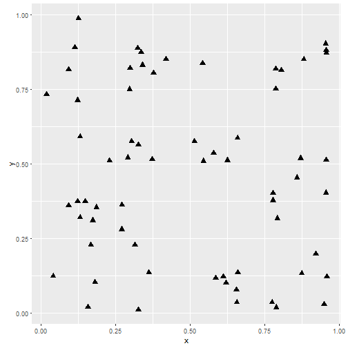
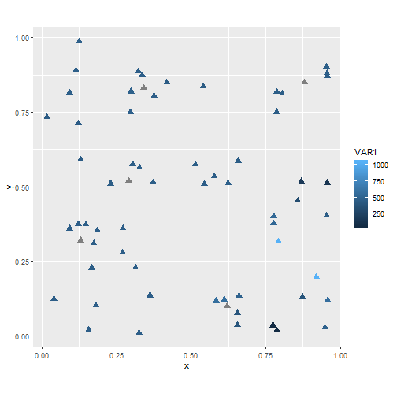
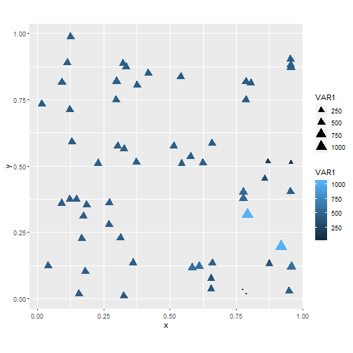
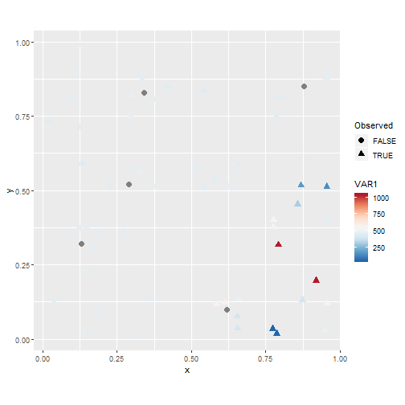
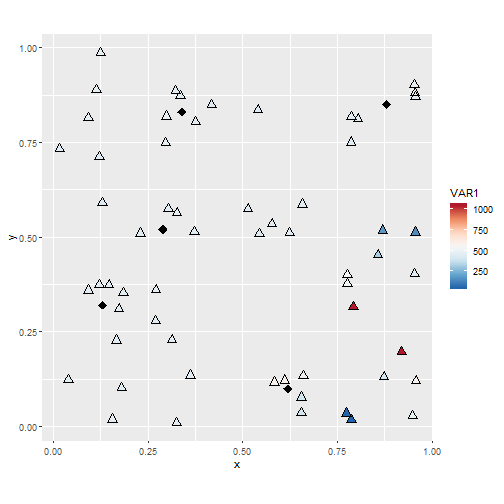

Mapping in R Continued 
========================================================
author: Megan Coad and Alexis Polidoro
date: 
autosize: true


Summarizing the Dataframe
========================================================


```r
summary(missing_df)
```

```
       x                 y                VAR1             VAR2       
 Min.   :0.01699   Min.   :0.01004   Min.   :  50.0   Min.   :  50.0  
 1st Qu.:0.22899   1st Qu.:0.19650   1st Qu.: 453.3   1st Qu.: 570.1  
 Median :0.41808   Median :0.50822   Median : 459.1   Median : 574.4  
 Mean   :0.49295   Mean   :0.46645   Mean   : 458.8   Mean   : 562.1  
 3rd Qu.:0.78580   3rd Qu.:0.74981   3rd Qu.: 465.4   3rd Qu.: 594.2  
 Max.   :0.95719   Max.   :0.98715   Max.   :1050.0   Max.   :1050.0  
                                     NA's   :5        NA's   :5       
      VAR3         Observed 
 Min.   :  50.0   FALSE: 5  
 1st Qu.: 630.3   TRUE :60  
 Median : 640.0             
 Mean   : 638.1             
 3rd Qu.: 646.0             
 Max.   :1050.0             
 NA's   :5                  
```

Factors
========================================================
- A factors describes a category 
- Examine the class of a variable by means of the function `class`
- allow us to store information that is not measured as a quantity

```r
class(missing_df$Observed)
```


```
[1] "factor"
```

Subsetting Data
========================================================
- use when you want to work only with parts of a dataset
- do this by indexing 
- different functions have the same result


```r
missing_df[missing_df$Observed == FALSE,]
subset(missing_df, Observed == FALSE)
filter(missing_df, Observed == FALSE)
```

Nesting Functions
========================================================
- Example from text

```r
summary(filter(missing_df, Observed == FALSE))
```

- this makes it hard to read code
- pipe operators solve this problem 

Pipe Operator
========================================================
- a pipe operator is written as '%>% 
-  it passes forward the output of a function to a second function

```r
subset(missing_df, Observed == FALSE) %>% summary()
```


More on Visualization
========================================================
- Observations in the sample dataset are georeferenced
based on a false origin
-  we can visualize their spatial distribution
- you have control over the shape and size of the markers 

***




More on Visualization Contd. 
========================================================
- there are more attributes that you can plot
- to make a thematic map of one of the variables you can set the colour to the desired variable


***





More on Visualization Contd. 
========================================================
- if you want to let other aesthetic attributes vary with the values of a variable in the dataframe you could set the size equal to a variable 

***




More on Visualization Contd. 
========================================================

- you can also change the colouring scheme by means of `scale_color_distiller`

***



More on Visualization Contd. 
========================================================

- you can add a layer with hollow symbols to makes points stand out more 
  
***


More on Visualization Contd. 
========================================================

-  you could try subsetting the data to have greater control of the appareance of your plot

***


