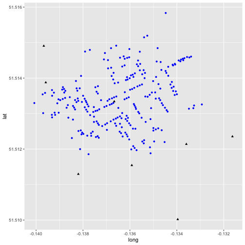

Introduction to Mapping in R 
========================================================
author: Megan Coad and Alexis Polidoro
date: 
autosize: true

Key Concepts
========================================================

- How do we Map in R? 
- Why do we Map? 
- Applications in R 


Loading Data Into R 
========================================================

Necessary for Spatial Analysis 


```r
rm(list = ls())
```


```r
library(geog4ga3)
```


```r
data("snow_deaths")
```


Graphing in R
========================================================

- Effective method for visualizing the contents of the dataframe
- Example of Broad Street Pumps and Deaths from John Snow Cholera Example


Leaflet Maps
========================================================

Interacting panning of Cholera Example


***

- Interactive Mapping
- Can look into this further using additional packages
- Heat Maps can also be used for preliminary spatial analysis

Graphing in R
========================================================



***

-Identifying different Variables 

Concluding Remarks
========================================================

- Clear Workspace
- R offers an abundance of ways to analyze information 
- Graphs are Important 

- R offers an abundance of ways to analyze information 
- Maps communicate information about a topic 
- We use code to visualize problems 


