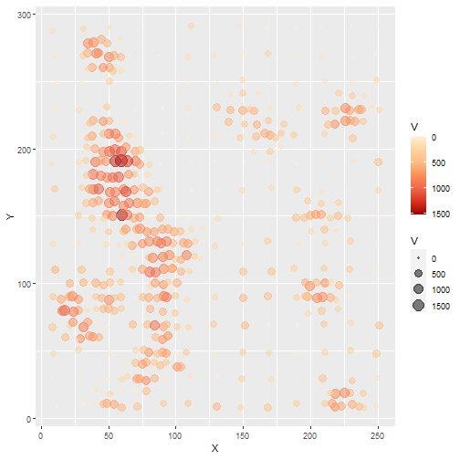

Spatially Continuous Data I
========================================================
author: Megan Coad and Alexis Polidoro 
date: 
autosize: true

Key Concepts
========================================================

- Exploring spatially continuous data
- Voronoi polygons
- Inverse distance weighting
- K-point means

Exploring Spatially Continuous Data
========================================================
- Think of points as an event 
- Data could be temperature, elevation
- Sampling method is not random, but the VALUE at the sampling site

***


Tile-Based Methods
========================================================
- Another method of gathering spatially continuous data
- Convert points into closely fitted arrangement of shapes
- Example: Voronoi polygons

***


```
Error in points2voronoi(uv_coords.sp) : 
  could not find function "points2voronoi"
```
